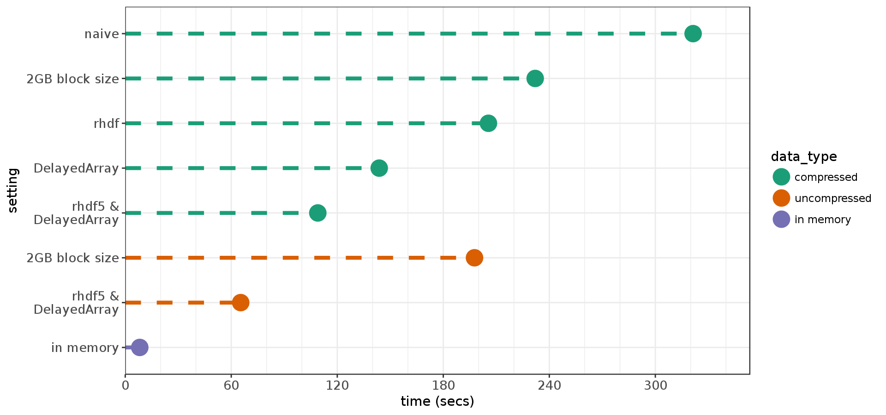

# TENxBrainData performance benchmarking

A collection of scripts to assess the performance of *R* & *Bioconductor* tools working with the 10X Genomics mouse brain data provided in [https://github.com/LTLA/TENxBrainData](https://github.com/LTLA/TENxBrainData).  This is discussed in my blog post at [www.msmith.de](http://www.msmith.de/2017/11/17/10x-1/).

## Files

Because some of the tests require installing alternative versions of R packages, which I couldn't achieve reliably once the **TENxBrainData** package and its dependencies had been loaded, I choose to run each step in a new R session.  As a result there is a seperate *.Rmd* file for each step detailed in the blog post.  The names of the files and their purposes are listed below.

| File          | Purpose       | 
| :------------ |:------------- |
| step1.Rmd     | Compute column sums using default settings, and compare with in-memory computation |
| step1a.Rmd    | Increase the **DelayedArray** block size |
| step2.Rmd     | Create uncompressed dataset and benchmark |
| step3.Rmd     | Install and run modified **rhdf** |
| step3a.Rmd    | Install and run modified **DelayedArray** |
| step4.Rmd     | Run with both modified **rhdf5** and **DelayedArray** |
| step5.Rmd     | Combine modified package with uncompressed dataset |
| stepN.Rmd     | Loads all saved results, checks consistency and produces plots |

## Running the scripts

Each *.Rmd* has an initial code block that checks the currently installed versions of *rhdf5* and *DelayedArray*, and installs the version require for the current test if needed.  Avoid running them in parallel, partly to reduced the risk of IO competition, but mostly to trying to install two versions of a package simultaneously and corrupting your R library.  I have mostly been running the Rmds consecutively in a single batch using the command below:

```
Rscript -e 'library("rmarkdown"); render("step1.Rmd")' && \
Rscript -e 'library("rmarkdown"); render("step1a.Rmd")' && \
Rscript -e 'library("rmarkdown"); render("step2.Rmd")' && \
Rscript -e 'library("rmarkdown"); render("step3.Rmd")' && \
Rscript -e 'library("rmarkdown"); render("step3a.Rmd")' && \
Rscript -e 'library("rmarkdown"); render("step4.Rmd")' && \
Rscript -e 'library("rmarkdown"); render("step5.Rmd")' && \
Rscript -e 'library("rmarkdown"); render("stepN.Rmd")'
```

## Results

